# 鼓楼校区流浪猫数字化社区平台项目文档

## 目录
- [项目目标](#项目目标)
- [具体功能](#具体功能)
- [实用性与创新性](#实用性与创新性)
- [技术实现](#技术实现)
- [开发流程](#开发流程)
- [项目分工](#项目分工)
- [UI设计](#ui设计)
- [代码实现](#代码实现)
- [教程资源](#教程资源)

---

## 项目目标
### 总体概述
> "人，想知道本喵是谁吗？"  
> "人，想知道本喵的成长轨迹吗？"  
> "人，想体验和本喵交流的温暖吗？"

以鼓楼校区流浪猫为纽带，打造兼具实用性与人文关怀的数字化社区平台。通过：
- **数据聚合**：建立结构化猫咪信息库
- **用户共创**：构建社区互动生态
- **智能算法**：实现精准服务与情感联结

### 核心设计理念
- **数据人性化**：疫苗接种状态 + 性格画像 + 成长日记
- **交互治愈化**：治愈语录生成器 + 习性时间表导航
- **服务精准化**：领养/筹款信息聚合 + 校园热点词库

---

## 具体功能

### 🐾 猫咪档案
**目的**：建立人猫认知桥梁  
**要素**：
- 基础信息
  - 名字
  - 出没地
  - 性格
- 健康状况
  - 疫苗接种情况
  - 体型特征（肥瘦相间）
- 领养状态

### 📔 猫咪日记
**目的**：构建云吸猫社区  
**功能**：
- 多媒体内容上传（文字/图片）
- 社交互动（点赞/评论）
- 智能分类（已知/未知猫咪标签）

### 🗺️ 猫咪地图
**目的**：提升偶遇概率  
**特色**：
- 鼓楼校区热力分布图
- 时间习性关联导航
- 实时位置标记系统

### 💬 猫咪的话
**目的**：提供情绪价值  
**机制**：
- 校园热点词库融合
- AI生成治愈语录  
*示例*：  
"两脚兽，你可以在本喵宽广的胸膛里哭泣"

### 🔥 周热搜
**目的**：优化救助效率  
**内容**：
- 紧急领养/筹款信息
- 高互动趣事精选
- 猫咪人气排行榜

---

## 实用性与创新性

### 现存问题
| 痛点 | 解决方案 |
|-------|----------|
| 信息分散 | 统一数据聚合平台 |
| 单向救助 | 双向情感联结机制 |
| 安全隐患 | 疫苗接种状态公示 |
| 内容碎片化 | 成长轨迹可视化 |

### 创新亮点
- **情感计算**：LSTM模型生成治愈语录
- **时空耦合**：猫咪出没时间-空间关联算法
- **社区自治**：用户UGC内容质量评估体系

---

## 技术实现

### 技术栈
| 层级 | 技术选型 |
|------|----------|
| 前端 | Vue.js + ElementUI |
| 后端 | SpringBoot + MySQL |
| 运维 | Git + GitHub Actions |

### 系统架构

```mermaid
graph TD
    A[用户端] --> B(Vue组件)
    B --> C[SpringBoot API]
    C --> D[(MySQL数据库)]
    D --> E[AI服务]
```


---

## 开发流程

1. **环境搭建**
   - 前端工程初始化
   - SpringBoot项目配置

2. **功能开发**
   ```bash
   # 前端开发
   $ npm run serve

   # 后端调试
   $ mvn spring-boot:run
   ```

3. **测试部署**
   - Jest单元测试
   - Postman接口测试
   - Nginx反向代理配置

---

## 项目分工

| 角色       | 成员                 | 职责                         |
|------------|----------------------|------------------------------|
| 前端开发   | 胡雨晨、王子兮       | Vue组件开发/状态管理         |
| 后端开发   | 郭恩熙、孙静怡       | SpringBoot接口开发/数据库设计 |
| 全栈协调   | 全体成员             | 接口联调/系统测试            |

---

## UI设计

### 主页面布局
```css
/* 响应式布局核心代码 */
.section {
  background: white;
  border-radius: 15px;
  padding: 20px;
  margin-bottom: 30px;
  box-shadow: 0 2px 5px rgba(0,0,0,0.1);
}

@media (max-width: 768px) {
  .cat-card {
    width: 100%;
  }
}
```

---

## 代码实现

### 数据模型示例
```javascript
// 猫咪数据结构
const cats = [{
  name: "大橘",
  location: "食堂门口",
  personality: "亲人贪吃",
  health: {
    vaccine: true,
    body: "肥胖"
  },
  adopted: false
}];
```

### 治愈语录生成器
```javascript
function generateMessage() {
  const messages = [
    "今天也是认真监督你学习的一天喵～",
    "你的小鱼干分我一半，我的快乐分你一半"
  ];
  return messages[Math.floor(Math.random()*messages.length)];
}
```

---

## 教程资源
- [前端开发图文教程](https://github.com/qianguyihao/Web)
- [B站前端入门教程](https://www.bilibili.com/video/BV1Kg411T7t9)
- [SpringBoot实践案例](https://github.com/527515025/springBoot)
```
